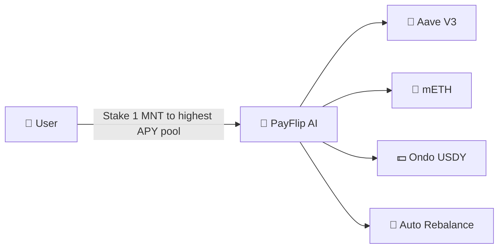
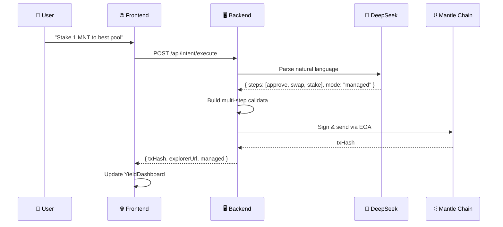
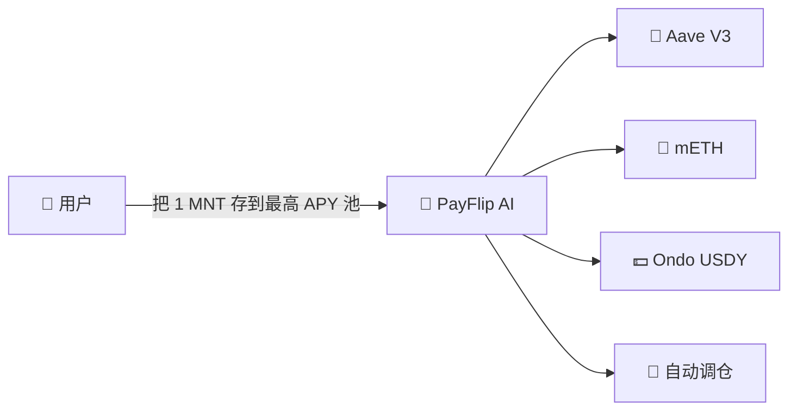
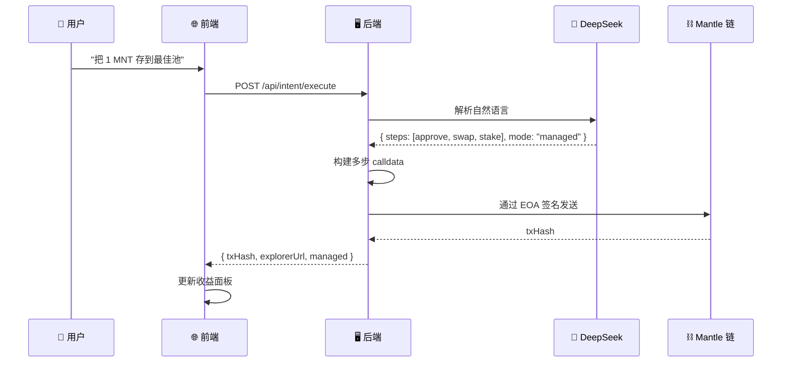

# PayFlip — AI-Powered DeFi Yield Agent on Mantle

---

## 📋 Table of Contents

- [Project Overview](#project-overview)
- [Highlights](#highlights)
- [Pain Points Solved](#pain-points-solved)
- [Tech Stack](#tech-stack)
- [Architecture](#architecture)
- [Quick Start](#quick-start)
- [Configuration](#configuration)
- [API Reference](#api-reference)
- [Project Structure](#project-structure)
- [Roadmap](#roadmap)

---

## Project Overview

**PayFlip** is an **AI-powered DeFi yield optimization agent** built on the **Mantle blockchain**. It transforms complex DeFi operations into simple natural language commands and automates yield farming strategies.



---

## Highlights

### 🤖 Natural Language DeFi

Say _"Stake 1 MNT to the highest APY pool"_ — the AI parses intent, builds multi-step calldata (approve → swap → stake), and executes automatically.

Powered by **DeepSeek API** with chain-of-thought reasoning for complex multi-protocol workflows.

### 🔄 Smart Auto-Rebalancing

- A **scheduler daemon** monitors yields every 30 minutes via DefiLlama API.
- Automatically detects APY improvements (>20% delta) and triggers migration.
- **Two modes**: `single` (one-time) or `managed` (continuous monitoring + auto-rebalance).

### 📦 Protocol Registry

- **JSON-driven** protocol adapters — add new protocols without code changes.
- Dynamic ABI encoding supports diverse deposit/withdraw signatures.

**Supported Protocols:**

| Protocol  | Type              | Assets               |
| --------- | ----------------- | -------------------- |
| mETH      | Liquid Staking    | MNT                  |
| Aave V3   | Lending           | USDT, USDC, DAI, MNT |
| Ondo USDY | Yield-bearing USD | USDT                 |

### 🔐 Flexible Signing

- **Backend auto-execution** — provide private key for server-side signing.

---

## Pain Points Solved

### ❌ Problem 1: DeFi is Too Complex

> **Users need to**: search for pools manually, compare APYs, research protocols, juggle multiple tabs, and manually execute multi-step transactions (approve → swap → stake → track).

✅ **PayFlip**: Just type _"put all my USDT into the best yield pool"_ — the AI handles everything from intent parsing to on-chain execution.

---

### ❌ Problem 2: Yield Fragmentation

> **DeFi yields** vary wildly across protocols and change constantly. Users must constantly monitor multiple positions and manually rebalance to chase the best returns — a full-time job.

✅ **PayFlip's** scheduler automatically monitors yields across all Mantle protocols and rebalances when better opportunities arise, without any user intervention.

---

### ❌ Problem 3: No Unified Interface

> Each protocol has its own UI, workflow, and gas requirements. Managing positions across Aave, mETH, and Ondo means navigating 3+ different apps.

✅ **PayFlip** provides a **single, unified dashboard** — view all yields, execute any DeFi operation, and manage your portfolio from one place.

---

## Tech Stack

### Backend

| Component  | Technology                                |
| ---------- | ----------------------------------------- |
| Language   | Go (1.22+)                                |
| Framework  | Gin (HTTP), go-ethereum (Ethereum client) |
| Blockchain | Mantle (go-ethereum)                      |
| AI / NLP   | DeepSeek API                              |
| Scheduler  | Custom goroutine-based daemon             |

### Frontend

| Component  | Technology     |
| ---------- | -------------- |
| Language   | TypeScript 6.x |
| Framework  | React 19       |
| Build Tool | Vite 8         |
| Styling    | Tailwind CSS 4 |
| Web3       | ethers.js 6    |

### Smart Contracts

| Component | Technology      |
| --------- | --------------- |
| Language  | Solidity        |
| Framework | Foundry (Forge) |
| Libraries | OpenZeppelin    |

---

## Architecture

```
┌───────────────────────────────────────────────────────┐
│              Frontend (React + Vite)                   │
│   ┌──────────────┐  ┌──────────────┐  ┌───────────┐  │
│   │ IntentInput  │  │ Yield        │  │ TxReceipt │  │
│   │              │  │ Dashboard    │  │           │  │
│   └──────┬───────┘  └──────────────┘  └───────────┘  │
│          └──────────────┬──────────────────┘          │
└─────────────────────────┬─────────────────────────────┘
                          │ POST /api/intent/execute
                          │ GET  /api/yield/current
                          ▼
┌───────────────────────────────────────────────────────┐
│              Backend API (Go + Gin)                    │
│                                                        │
│  ┌───────────────────────────────────────────────┐    │
│  │ IntentHandler          YieldHandler           │    │
│  └─────────┬─────────────────────┬───────────────┘    │
│            │                     │                     │
│  ┌─────────▼──────┐   ┌─────────▼──────────────┐     │
│  │ IntentService  │   │ YieldService           │     │
│  │ DeepSeek NLP   │   │ DefiLlama Integration  │     │
│  │ Step Planning  │   │ Protocol Ranking       │     │
│  └─────────┬──────┘   └─────────┬──────────────┘     │
│            │                     │                     │
│  ┌─────────▼─────────────────────▼──────────────┐     │
│  │ Core Components                              │     │
│  │  TxManager · Builder · Sender               │     │
│  │  Scheduler · ProtocolRegistry                │     │
│  └─────────┬───────────────────────────────────┘     │
└─────────────┬─────────────────────────────────────────┘
              │ JSON-RPC
              ▼
┌───────────────────────────────────────────────────────┐
│              Mantle Blockchain                        │
│  ┌──────────┐  ┌──────────┐  ┌──────────┐  ┌──────┐ │
│  │ Aave V3  │  │  mETH    │  │Ondo USDY │  │       │ │
│  └──────────┘  └──────────┘  └──────────┘  │Entry │ │
│                                             │Point │ │
│                                             └──────┘ │
└───────────────────────────────────────────────────────┘
```

### Data Flow



---

## Quick Start

### Prerequisites

- **Go** 1.22+
- **Node.js** 20+ & **pnpm** (recommended) or npm
- **Foundry** (for contract development, optional)
- **Mantle RPC URL** (mainnet or testnet)

### Backend Setup

```bash
cd backend

# Configure environment variables
cp .env.example .env
# Edit .env — set MANTLE_RPC_URL, DEEPSEEK_API_KEY

# Run
go run ./cmd/api/
```

The backend starts on **`http://localhost:8001`** by default.

### Frontend Setup

```bash
cd frontend

# Install dependencies
pnpm install

# Start dev server
pnpm dev
```

The frontend dev server starts on **`http://localhost:5173`** (Vite default).

### Smart Contracts (Optional)

```bash
cd contracts

# Build
forge build

# Test
forge test
```

---

## Configuration

### Environment Variables (`backend/.env`)

| Variable           | Required | Default                  | Description                              |
| ------------------ | -------- | ------------------------ | ---------------------------------------- |
| `MANTLE_RPC_URL`   | ✅       | `https://rpc.mantle.xyz` | Mantle RPC endpoint                      |
| `MANTLE_CHAIN_ID`  | ✅       | `5000`                   | 5000=mainnet, 5001=testnet, 5003=Sepolia |
| `DEEPSEEK_API_KEY` | ✅       | —                        | DeepSeek API key for intent parsing      |
| `DB_DSN`           | ❌       | PostgreSQL DSN           | Optional database for logging            |
| `API_PORT`         | ❌       | `8001`                   | Backend HTTP server port                 |

### Protocols (`backend/config/protocols.json`)

Add or modify protocols in this JSON file. Each protocol needs:

```json
{
  "name": "Protocol Name",
  "poolAddress": "0x...",
  "depositSig": "deposit(address,uint256,address)",
  "withdrawSig": "withdraw(address,uint256,address)",
  "assets": ["USDT", "MNT"],
  "receiptToken": "aUSDT"
}
```

---

## API Reference

### `GET /health`

**Health check**

```json
{ "status": "ok", "chain": "Mantle" }
```

---

### `POST /api/intent/execute`

**Execute natural language DeFi operation**

**Request:**

```json
{
  "input": "Swap 1 MNT to USDT and stake to Aave",
  "walletPk": "0x..."
}
```

**Response (success):**

```json
{
  "success": true,
  "txHash": "0x...",
  "explorerUrl": "https://mantlescan.io/tx/0x...",
  "steps": "[{Action:approve...}]",
  "mode": "single"
}
```

**Response (managed mode):**

```json
{
  "success": true,
  "txHash": "0x...",
  "explorerUrl": "https://mantlescan.io/tx/0x...",
  "steps": "...",
  "mode": "managed",
  "managed": true
}
```

---

### `GET /api/yield/current`

**Fetch real-time Mantle yield pools**

```json
{
  "pools": [
    {
      "pool": "Aave V3:USDT",
      "project": "Aave V3",
      "symbol": "USDT",
      "apy": 12.34,
      "tvlUsd": 100000000
    }
  ]
}
```

---

### `POST /api/yield/rebalance`

**Trigger manual rebalance**

```json
{
  "walletPk": "0x...",
  "strategy": "highest_apy"
}
```

---

### `POST /api/yield/register` & `POST /api/managed/register`

**Register wallet for managed monitoring**

```json
{
  "privateKey": "0x..."
}
```

---

## Project Structure

```
mantleVault-hacker/
├── backend/                          # Go backend
│   ├── cmd/api/main.go              # Entry point
│   ├── config/
│   │   ├── config.go                # Env vars & chain config
│   │   ├── config_test.go
│   │   ├── protocols.go             # Protocol registry logic
│   │   └── protocols.json           # Protocol adapters
│   ├── internal/
│   │   ├── api/                     # HTTP handlers
│   │   │   ├── router.go           # Route setup
│   │   │   ├── intent_handler.go   # NLP intent execution
│   │   │   └── yield_handler.go    # Yield & rebalance
│   │   ├── scheduler/
│   │   │   └── cron.go             # Auto-rebalance daemon
│   │   ├── services/
│   │   │   ├── intent_service.go   # DeepSeek NLP parsing
│   │   │   ├── intent_executor.go  # Calldata execution
│   │   │   ├── yield_service.go    # DefiLlama data fetch
│   │   │   └── rebalance_service.go# Rebalance logic
│   │   └── tx/                      # Transaction management
│   │       ├── builder.go          # Calldata builder
│   │       ├── manager.go          # Tx lifecycle
│   │       ├── nonce.go            # Nonce management
│   │       └── sender.go           # Tx broadcasting
│   └── go.mod
├── frontend/                         # React frontend
│   ├── src/
│   │   ├── App.tsx                  # Main app
│   │   ├── main.tsx                 # Entry
│   │   ├── index.css                # Tailwind styles
│   │   ├── components/
│   │   │   ├── IntentInput.tsx      # NLP input
│   │   │   ├── YieldDashboard.tsx   # Yield display
│   │   │   ├── TxReceipt.tsx        # Tx result
│   │   │   ├── YieldDashboard.tsx   # Yield dashboard
│   │   │   └── ManagedPanel.tsx     # Managed mode panel
│   │   └── lib/
│   │       └── api.ts              # API client
│   └── package.json
├── contracts/                        # Smart contracts (optional)
│   ├── src/Counter.sol
│   ├── test/Counter.t.sol
│   └── foundry.toml
└── README.md
```

---

## Roadmap

- [x] ✅ Natural language intent parsing (DeepSeek)
- [x] ✅ Multi-step calldata generation (approve → swap → stake)
- [x] ✅ Protocol registry (mETH, Aave V3, Ondo USDY)
- [x] ✅ DefiLlama yield data integration
- [x] ✅ Automatic yield rebalancing scheduler
- [x] ✅ Dual execution modes (single + managed)
- [ ] 🔲 WebSocket real-time yield updates
- [ ] 🔲 Telegram / Discord bot notifications
- [ ] 🔲 More protocol adapters (LayerBank, Agni, etc.)
- [ ] 🔲 Multi-chain support beyond Mantle
- [ ] 🔲 Portfolio tracker with P&L history
- [ ] 🔲 Mobile responsive dashboard

---

---

---

# PayFlip — 基于 Mantle 的 AI DeFi 收益代理

---

## 目录

- [项目简介](#项目简介)
- [核心亮点](#核心亮点)
- [解决的问题](#解决的问题)
- [技术栈](#技术栈)
- [架构](#架构)
- [快速开始](#快速开始)
- [配置](#配置)
- [API 参考](#api-参考)
- [项目结构](#项目结构)
- [路线图](#路线图)

---

## 项目简介

**PayFlip** 是一个基于 **Mantle 区块链** 的 **AI 驱动的 DeFi 收益优化代理**。它将复杂的 DeFi 操作转化为简单的自然语言指令，自动化收益耕作策略。



---

## 核心亮点

### 🤖 自然语言驱动 DeFi

说 _"帮我把 1 MNT 质押到最高 APY 池"_ — AI 解析意图，构建多步 calldata（授权 → 兑换 → 质押），自动执行。

由 **DeepSeek API** 驱动，支持链式推理，处理复杂的跨协议多步操作。

### 🔄 智能自动调仓

- **定时调度守护进程**每 30 分钟通过 DefiLlama API 监控收益变化。
- 自动检测 APY 提升（>20% 差异），触发资金迁移。
- **两种模式**：`single`（一次性操作）或 `managed`（持续监控 + 自动调仓）。

### 📦 协议注册表

- **JSON 驱动**的协议适配器 — 新增协议无需改代码。
- 动态 ABI 编码，支持多种存取款函数签名。

**已支持协议：**

| 协议      | 类型       | 资产                 |
| --------- | ---------- | -------------------- |
| mETH      | 流动性质押 | MNT                  |
| Aave V3   | 借贷       | USDT, USDC, DAI, MNT |
| Ondo USDY | 收益型美元 | USDT                 |

### 🔐 灵活签名方式

- **后端自动执行** — 提供私钥，服务端自动签名发送。
- **后端自动执行** — 提供私钥由服务端签名。

---

## 解决的问题

### ❌ 问题 1：DeFi 太复杂

> **用户需要**：手动搜索池子、对比 APY、研究协议、打开多个标签页、手动执行多步交易（授权 → 兑换 → 质押 → 跟踪）。

✅ **PayFlip**：只需输入 _"把我所有的 USDT 都存到最佳收益池"_ — AI 搞定从意图解析到链上执行的全流程。

---

### ❌ 问题 2：收益率碎片化

> **DeFi 收益率**在不同协议间差异巨大且持续变化。用户必须持续监控多个仓位并手动调仓以追求最佳收益 — 这本身就是一份全职工作。

✅ **PayFlip** 的调度器自动监控所有 Mantle 协议的收益率，在出现更优机会时自动调仓，无需用户干预。

---

### ❌ 问题 3：缺乏统一界面

> 每个协议都有自己的界面、工作流和 Gas 要求。在 Aave、mETH 和 Ondo 之间管理仓位意味着需要操作 3 个以上不同的应用。

✅ **PayFlip** 提供 **统一的仪表盘** — 在一个地方查看所有收益、执行任意 DeFi 操作、管理你的投资组合。

---

## 技术栈

### 后端

| 组件     | 技术                                   |
| -------- | -------------------------------------- |
| 语言     | Go (1.22+)                             |
| 框架     | Gin (HTTP), go-ethereum (以太坊客户端) |
| 区块链   | Mantle (go-ethereum)                   |
| AI / NLP | DeepSeek API                           |
| 调度器   | 基于 goroutine 的自定义守护进程        |

### 前端

| 组件     | 技术           |
| -------- | -------------- |
| 语言     | TypeScript 6.x |
| 框架     | React 19       |
| 构建工具 | Vite 8         |
| 样式     | Tailwind CSS 4 |
| Web3     | ethers.js 6    |

### 智能合约

| 组件 | 技术            |
| ---- | --------------- |
| 语言 | Solidity        |
| 框架 | Foundry (Forge) |
| 库   | OpenZeppelin    |

---

## 架构

```
┌───────────────────────────────────────────────────────┐
│                  前端 (React + Vite)                    │
│   ┌──────────────┐  ┌──────────────┐  ┌───────────┐  │
│   │ IntentInput  │  │ Yield        │  │ TxReceipt │  │
│   │ (意图输入)    │  │ Dashboard    │  │ (交易收据) │  │
│   └──────┬───────┘  │ (收益面板)    │  └───────────┘  │
│          │          └──────────────┘                  │
│          └──────────────┬──────────────────┘          │
└─────────────────────────┬─────────────────────────────┘
                          │ POST /api/intent/execute
                          │ GET  /api/yield/current
                          ▼
┌───────────────────────────────────────────────────────┐
│                 后端 API (Go + Gin)                    │
│                                                        │
│  ┌───────────────────────────────────────────────┐    │
│  │ IntentHandler          YieldHandler           │    │
│  │ 意图解析 + 执行         收益数据 + 调仓          │    │
│  └─────────┬─────────────────────┬───────────────┘    │
│            │                     │                     │
│  ┌─────────▼──────┐   ┌─────────▼──────────────┐     │
│  │ IntentService  │   │ YieldService           │     │
│  │ DeepSeek NLP   │   │ DefiLlama 数据集成      │     │
│  │ 步骤规划       │   │ 协议排名                │     │
│  └─────────┬──────┘   └─────────┬──────────────┘     │
│            │                     │                     │
│  ┌─────────▼─────────────────────▼──────────────┐     │
│  │ 核心组件                                      │     │
│  │  TxManager · Builder · Sender                │     │
│  │  Scheduler · ProtocolRegistry                 │     │
│  └─────────┬───────────────────────────────────┘     │
└─────────────┬─────────────────────────────────────────┘
              │ JSON-RPC
              ▼
┌───────────────────────────────────────────────────────┐
│                  Mantle 区块链                         │
│  ┌──────────┐  ┌──────────┐  ┌──────────┐  ┌──────┐ │
│  │ Aave V3  │  │  mETH    │  │Ondo USDY │  │       │ │
│  └──────────┘  └──────────┘  └──────────┘  │Entry │ │
│                                             │Point │ │
│                                             └──────┘ │
└───────────────────────────────────────────────────────┘
```

### 数据流



---

## 快速开始

### 前置要求

- **Go** 1.22+
- **Node.js** 20+ & **pnpm**（推荐）或 npm
- **Foundry**（合约开发，可选）
- **Mantle RPC URL**（主网或测试网）

### 后端启动

```bash
cd backend

# 配置环境变量
cp .env.example .env
# 编辑 .env — 设置 MANTLE_RPC_URL, DEEPSEEK_API_KEY

# 启动
go run ./cmd/api/
```

后端默认启动在 **`http://localhost:8001`**。

### 前端启动

```bash
cd frontend

# 安装依赖
pnpm install

# 启动开发服务器
pnpm dev
```

前端开发服务器默认启动在 **`http://localhost:5173`**。

### 智能合约（可选）

```bash
cd contracts

# 编译
forge build

# 测试
forge test
```

---

## 配置

### 环境变量 (`backend/.env`)

| 变量               | 必填 | 默认值                   | 说明                                 |
| ------------------ | ---- | ------------------------ | ------------------------------------ |
| `MANTLE_RPC_URL`   | ✅   | `https://rpc.mantle.xyz` | Mantle RPC 地址                      |
| `MANTLE_CHAIN_ID`  | ✅   | `5000`                   | 5000=主网, 5001=测试网, 5003=Sepolia |
| `DEEPSEEK_API_KEY` | ✅   | —                        | DeepSeek API 密钥，用于意图解析      |
| `DB_DSN`           | ❌   | PostgreSQL DSN           | 可选的数据库，用于日志记录           |
| `API_PORT`         | ❌   | `8001`                   | 后端 HTTP 服务端口                   |

### 协议配置 (`backend/config/protocols.json`)

在此 JSON 文件中添加或修改协议。每个协议需要：

```json
{
  "name": "协议名称",
  "poolAddress": "0x...",
  "depositSig": "deposit(address,uint256,address)",
  "withdrawSig": "withdraw(address,uint256,address)",
  "assets": ["USDT", "MNT"],
  "receiptToken": "aUSDT"
}
```

---

## API 参考

### `GET /health`

**健康检查**

```json
{ "status": "ok", "chain": "Mantle" }
```

---

### `POST /api/intent/execute`

**执行自然语言 DeFi 操作**

**请求：**

```json
{
  "input": "Swap 1 MNT to USDT and stake to Aave",
  "walletPk": "0x..."
}
```

**响应（成功）：**

```json
{
  "success": true,
  "txHash": "0x...",
  "explorerUrl": "https://mantlescan.io/tx/0x...",
  "steps": "[{Action:approve...}]",
  "mode": "single"
}
```

**响应（托管模式）：**

```json
{
  "success": true,
  "txHash": "0x...",
  "explorerUrl": "https://mantlescan.io/tx/0x...",
  "steps": "...",
  "mode": "managed",
  "managed": true
}
```

---

### `GET /api/yield/current`

**获取实时 Mantle 收益池**

```json
{
  "pools": [
    {
      "pool": "Aave V3:USDT",
      "project": "Aave V3",
      "symbol": "USDT",
      "apy": 12.34,
      "tvlUsd": 100000000
    }
  ]
}
```

---

### `POST /api/yield/rebalance`

**触发手动调仓**

```json
{
  "walletPk": "0x...",
  "strategy": "highest_apy"
}
```

---

### `POST /api/yield/register` & `POST /api/managed/register`

**注册托管监控钱包**

```json
{
  "privateKey": "0x..."
}
```

---

## 项目结构

```
mantleVault-hacker/
├── backend/                          # Go 后端
│   ├── cmd/api/main.go              # 入口
│   ├── config/
│   │   ├── config.go                # 环境变量与链配置
│   │   ├── config_test.go
│   │   ├── protocols.go             # 协议注册表逻辑
│   │   └── protocols.json           # 协议适配器
│   ├── internal/
│   │   ├── api/                     # HTTP 处理器
│   │   │   ├── router.go           # 路由设置
│   │   │   ├── intent_handler.go   # NLP 意图执行
│   │   │   └── yield_handler.go    # 收益与调仓
│   │   ├── scheduler/
│   │   │   └── cron.go             # 自动调仓守护进程
│   │   ├── services/
│   │   │   ├── intent_service.go   # DeepSeek NLP 解析
│   │   │   ├── intent_executor.go  # Calldata 执行
│   │   │   ├── yield_service.go    # DefiLlama 数据获取
│   │   │   └── rebalance_service.go# 调仓逻辑
│   │   └── tx/                      # 交易管理
│   │       ├── builder.go          # Calldata 构建器
│   │       ├── manager.go          # 交易生命周期
│   │       ├── nonce.go            # Nonce 管理
│   │       └── sender.go           # 交易广播
│   └── go.mod
├── frontend/                         # React 前端
│   ├── src/
│   │   ├── App.tsx                  # 主应用
│   │   ├── main.tsx                 # 入口
│   │   ├── index.css                # Tailwind 样式
│   │   ├── components/
│   │   │   ├── IntentInput.tsx      # 自然语言输入
│   │   │   ├── YieldDashboard.tsx   # 收益展示
│   │   │   ├── TxReceipt.tsx        # 交易结果
│   │   │   ├── YieldDashboard.tsx   # 收益仪表盘
│   │   │   └── ManagedPanel.tsx     # 托管模式面板
│   │   └── lib/
│   │       └── api.ts              # API 客户端
│   └── package.json
├── contracts/                        # 智能合约（可选）
│   ├── src/Counter.sol
│   ├── test/Counter.t.sol
│   └── foundry.toml
└── README.md
```

---

## 路线图

- [x] ✅ 自然语言意图解析（DeepSeek）
- [x] ✅ 多步 Calldata 生成（授权 → 兑换 → 质押）
- [x] ✅ 协议注册表（mETH, Aave V3, Ondo USDY）
- [x] ✅ DefiLlama 收益数据集成
- [x] ✅ 自动收益调仓调度器
- [x] ✅ 双执行模式（单次 + 托管）
- [ ] 🔲 WebSocket 实时收益更新
- [ ] 🔲 Telegram / Discord 机器人通知
- [ ] 🔲 更多协议适配器（LayerBank, Agni 等）
- [ ] 🔲 多链支持（超越 Mantle）
- [ ] 🔲 投资组合追踪器（含盈亏历史）
- [ ] 🔲 移动端自适应仪表盘

---

## 免责声明

**这是一个实验性项目，仅用于教育和研究目的。请自行承担使用风险。智能合约交互涉及真实资产和固有风险。在使用真实资金部署前，请务必仔细审查和充分测试。**
